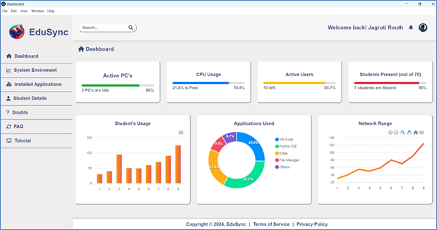
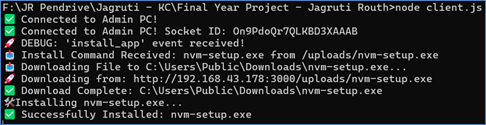
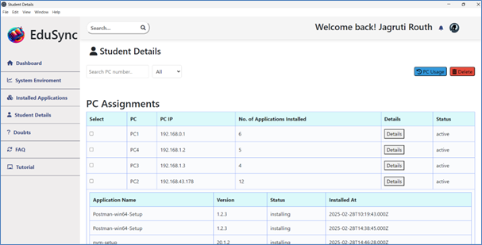

# EduSync – Unified Lab Network Management 🖥️

A centralized lab control system built using **Electron** and **Node.js** that enables administrators to manage and monitor multiple student PCs from a single admin dashboard. Designed for educational labs to streamline the installation, updating, and uninstallation of applications during lectures, exams, or practical sessions.

## 🚀 Features
- Real-time connection with student PCs via **Socket.io**
- Remote **installation**, **update**, and **uninstallation** of applications
- **Notification system** for new connections, disconnections, and install success/failure
- Tracks application install status: `installing`, `installed`, `failed`
- Each student PC is **uniquely identified and stored** in a MySQL database
- Logs every activity (e.g., command sent, response received, failure handled)
- Desktop app with easy-to-use GUI built using **Electron**

## 🛠️ Tech Stack

| Component        | Technology       |
|------------------|------------------|
| Frontend (UI)    | Electron, HTML/CSS/JS |
| Backend (Server) | Node.js, Socket.io |
| Database         | MySQL            |
| Communication    | WebSockets       |
| OS               | Windows/Linux    |

## 📸 Screenshots (Optional – Upload images first)

### 🖥️ Admin Dashboard  

### 🧾 Live Logs  

### PC Details  

---

🧠 Use Case
Designed for college/university labs where a Class Representative (CR) or admin faculty can:
Push software installs to all PCs
Track connection status of students
Control lab PCs from one dashboard

